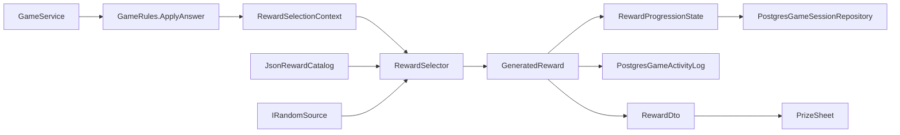
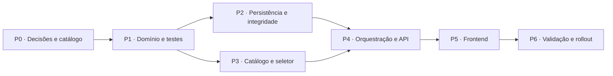

# Plano técnico de implementação: nivelamento inteligente dos prêmios

## 1. Identificação

| Campo | Valor |
|---|---|
| Status | Implementado, validado e ativo por padrão |
| Tipo | Plano técnico e de entrega |
| Documento de produto | [`proposta-nivelamento-inteligente-de-premios.md`](../proposta-nivelamento-inteligente-de-premios.md) |
| Backend atual | .NET 8, ASP.NET Core, EF Core 8 e PostgreSQL |
| Frontend atual | React 18, TypeScript e Vite |
| Escopo | Catálogo curado, níveis 1–4, progressão por roupas, contexto, cooldown, persistência, API e UI |
| Fora do escopo | Configurações, preferências, coleta de consentimento e requisitos legais/jurídicos |

### Situação da entrega em 13/07/2026

Os pacotes P1 a P5 foram implementados. A solução inclui catálogo curado,
seletor inteligente, progressão persistida, resposta idempotente, concorrência
otimista, histórico estruturado, prêmio terminal e retomada do resultado no
frontend. A migration foi gerada e o SQL validado, mas não foi aplicada ao
banco por esta implementação.

A seleção inteligente é o comportamento padrão. O provider cartesiano legado
continua disponível apenas para rollback explícito com
`Rewards__IntelligentSelectionEnabled=false`.

A validação automatizada atual possui 21 testes cobrindo cálculo de nível,
requisitos de roupa, distribuição determinística, filtros, fallback, catálogo,
idempotência, avanço de rodada e compatibilidade de retomada do prêmio legado.

## 2. Objetivo

Substituir o sorteio cartesiano atual por um mecanismo que sorteie somente entre
templates completos e elegíveis. A entrega deve:

- impossibilitar combinações não cadastradas, como “mordida no nariz”;
- calcular o estágio pelas peças perdidas;
- suavizar a transição com distribuição 50/50 e depois 75/25;
- respeitar papéis, acessibilidade e estado das roupas;
- reduzir repetições por cooldown e pesos de novidade;
- sobreviver a refresh, restart e retomada;
- manter compatibilidade temporária com o contrato atual da API;
- ser testável sem depender de aleatoriedade global;
- não introduzir input, perfil ou preferência de jogador.

## 3. Decisões técnicas

### DT-01 — Catálogo JSON versionado e embarcado

O catálogo canônico será:

```text
Backend/src/Game.Infrastructure/Data/Rewards/reward-templates.v1.json
```

O arquivo será um `EmbeddedResource`, carregado uma vez por `IRewardCatalog` e
mantido imutável em memória.

Motivos:

- revisão de conteúdo por pull request;
- versão alinhada ao código que interpreta o schema;
- deploy e rollback reproduzíveis;
- ausência de seeding incremental;
- nenhuma interface administrativa neste escopo;
- possibilidade futura de trocar JSON por banco atrás da mesma interface.

Não será criada tabela `reward_templates` nesta entrega.

### DT-02 — Template completo como unidade de sorteio

O algoritmo selecionará um `RewardTemplate` completo. Ação, local e forma de
execução não serão escolhidos de listas globais independentes. Somente parâmetros
declarados no template poderão variar.

### DT-03 — Progressão derivada das roupas

```text
mostExposedPlayerLosses = max(4 - player.RemainingClothesCount)
currentRewardLevel = clamp(1 + mostExposedPlayerLosses, 1, 4)
```

| Maior perda individual | Nível |
|---:|---:|
| 0 peças | 1 |
| 1 peça | 2 |
| 2 peças | 3 |
| 3 ou 4 peças | 4 |

O cálculo ocorre depois de `GameRules.ApplyAnswer`, incluindo a peça perdida na
resposta atual.

### DT-04 — Progressão persistida na sessão

O contador do estágio e a janela de cooldown precisam sobreviver à reconstrução
da entidade. A sessão armazenará `RewardProgressionState` em JSONB. O log de
prêmios não será fonte de verdade porque atualmente é gravado em melhor esforço.

### DT-05 — Aleatoriedade injetável

O seletor dependerá de `IRandomSource`, com `SystemRandomSource` em produção e
implementação determinística nos testes. `Random.Shared` não será usado dentro da
nova lógica.

### DT-06 — API aditiva

`AnswerResultDto` manterá temporariamente:

```text
Reward: string?
```

e acrescentará:

```text
RewardDetails: RewardDto?
```

O frontend priorizará `RewardDetails.Text` e fará fallback para `Reward`.

### DT-07 — Exibir prêmio final

Quando um acerto encerrar a partida, o prêmio será mostrado antes da tela de fim
de jogo. Isso preserva a regra “todo acerto gera prêmio” e permite nível 4 no
fechamento.

### DT-08 — Feature flag

Adicionar:

```json
{
  "Rewards": {
    "IntelligentSelectionEnabled": true,
    "CatalogResource": "reward-templates.v1.json"
  }
}
```

Com a flag desligada, o provider legado permanece ativo. Com a flag ligada, todo
acerto usa o seletor inteligente.

## 4. Escopo

### 4.1 Incluído

- schema e validação de templates;
- catálogo inicial dos quatro níveis;
- cálculo por roupas e transição gradual;
- seleção ponderada e testável;
- adversário oferece e vencedor da pergunta recebe;
- requisitos de roupa do recebedor;
- cooldown por rodada, família e local;
- fallback controlado;
- progressão persistida;
- histórico estruturado;
- proteção contra resposta duplicada;
- rodada persistida e concorrência otimista;
- contrato estruturado e frontend;
- prêmio terminal, observabilidade e rollout.

### 4.2 Excluído

- configurações ou preferências de jogadores;
- bloqueios definidos por usuário;
- votos ou checkpoints de intensidade;
- adaptação baseada em “Feito” ou “Pular”;
- feedback sobre o prêmio;
- administração do catálogo em runtime;
- personalização por casal;
- escopo legal/jurídico.

## 5. Estado atual e lacunas

| Área | Estado atual | Lacuna |
|---|---|---|
| Catálogo | três arrays em `PrizeSeedData` | não expressa combinação, nível ou requisitos |
| Sorteio | três usos independentes de `Random.Shared` | incoerente e difícil de testar |
| Domínio | `Reward` tem ação, local e segundos | sem template, nível, execução ou papéis |
| Progressão | inexistente | sem nível, contador ou janela recente |
| Rodada | estado local React | perde valor no refresh e não suporta cooldown |
| Resposta | aceita repetição antes de `/next` | pode duplicar punição e prêmio |
| Concorrência | sem token de versão | requisições podem sobrescrever estado |
| Histórico | texto/ação/local/duração em melhor esforço | sem template, nível, papéis ou rodada |
| API | prêmio como string | cliente não conhece metadados |
| Fim de jogo | prêmio terminal oculto | último estágio não é exibido |

## 6. Arquitetura alvo



| Componente | Responsabilidade |
|---|---|
| `RewardRules` | calcular nível e mudança de estágio |
| `IRewardCatalog` | fornecer catálogo e versão |
| `RewardCatalogValidator` | rejeitar catálogo inválido |
| `IRewardSelector` | filtrar, ponderar e instanciar prêmio |
| `IRandomSource` | aleatoriedade substituível |
| `RewardProgressionState` | estágio, contador e janela recente |
| `GameService` | montar contexto e orquestrar persistência |
| Repositórios PostgreSQL | persistir sessão e histórico |
| `RewardDto` | contrato aditivo |
| `PrizeSheet` | exibição e fluxo terminal |

## 7. Modelo de domínio

### 7.1 Enums

Criar em `Game.Domain/Enums`:

```text
RewardIntensityLevel: Connection=1, Approach=2, Tension=3, Intimacy=4
RewardExecutionType: Seconds, Repetitions, FreeForm
RewardAccessibility: Any, OverClothingAllowed, ExposedAreaRequired
RewardActorRole: Opponent
RewardReceiverRole: Winner
```

Papéis terão uma opção nesta versão para tornar a regra e o texto explícitos.
Novos valores não fazem parte desta entrega.

### 7.2 `RewardTemplate`

```text
RewardTemplate
- Id: string
- CatalogVersion: string
- TextTemplate: string
- ActionFamily: string
- Location: string
- IntensityLevel: int
- ExecutionType: RewardExecutionType
- AllowedExecutionValues: list<string>
- ActorRole: RewardActorRole
- ReceiverRole: RewardReceiverRole
- Accessibility: RewardAccessibility
- RequiredClothingState: list<ClothingItem>
- ContentTags: list<string>
- CooldownRounds: int
- BaseWeight: decimal
- Active: bool
```

IDs devem ser estáveis e em `snake_case`, como `massage_shoulders`.

### 7.3 `GeneratedReward`

```text
GeneratedReward
- TemplateId
- CatalogVersion
- Text
- ActionFamily
- Location
- IntensityLevel
- ExecutionType
- ExecutionValue
- ActorPlayerId
- ReceiverPlayerId
- RoundNumber
- GeneratedAt
```

O texto será renderizado no backend, garantindo o mesmo conteúdo nos dois
aparelhos.

### 7.4 `RewardProgressionState`

```text
RewardProgressionState
- CurrentLevel: int = 1
- RewardsGeneratedInCurrentStage: int = 0
- RecentRewards: list<RecentRewardSnapshot>

RecentRewardSnapshot
- TemplateId
- ActionFamily
- Location
- ExecutionValue
- IntensityLevel
- RoundNumber
```

Reter no máximo 12 snapshots.

### 7.5 Novos campos de `GameSession`

```text
- RoundNumber: int = 1
- AnsweredRoundNumber: int?
- PendingRoundResult: PendingRoundResult?
- RewardProgression: RewardProgressionState
- Version: long
```

`PendingRoundResult` guarda o resultado necessário para tornar `/answer`
idempotente e recuperar a tela transitória após refresh. Ele contém rodada,
pergunta, opção correta, resultado, IDs dos jogadores, peça perdida, prêmio gerado
e eventual vencedor, mas não contém feedback ou preferência.

## 8. Catálogo e validação

### 8.1 Envelope JSON

```json
{
  "catalogVersion": "1.0.0",
  "templates": []
}
```

### 8.2 Validações bloqueantes

Com a feature ativa, o startup falha se houver:

- versão ausente/inválida;
- ID vazio ou duplicado;
- nível fora de 1–4;
- peso menor ou igual a zero;
- cooldown negativo ou acima do limite operacional;
- placeholder desconhecido ou obrigatório ausente;
- execução sem valores ou com valor incompatível;
- papel fora da regra adversário → vencedor;
- `ExposedAreaRequired` sem requisito de roupa;
- template ativo sem família/local;
- combinação na denylist;
- nível sem template ativo;
- nível sem cobertura mínima.

### 8.3 Cobertura mínima

Antes da ativação, cada nível deve ter:

- pelo menos 12 templates; nível 4 pode iniciar com 8 mediante aceite de Produto;
- 3 famílias de ação;
- 4 locais/contextos;
- 4 templates `Any` ou `OverClothingAllowed`;
- 2 templates elegíveis com o recebedor totalmente vestido, inclusive nos níveis
  3 e 4.

Isso cobre partidas desequilibradas, nas quais o nível sobe porque o adversário
perdeu roupas e o recebedor continua vestido.

### 8.4 Denylist técnica

Manter defesa mínima além da curadoria:

```text
GentleBite + Nose => inválido
GentleBite + Face => inválido
GentleBite + Throat => inválido
```

O catálogo não carrega se violar a política.

## 9. Algoritmo formal

### 9.1 Contexto

```text
RewardSelectionContext
- SessionId
- RoundNumber
- CurrentLevel
- RewardsGeneratedInCurrentStage
- Actor
- Receiver
- ReceiverClothingState
- RecentRewards
```

Em acerto, `Actor` é o adversário e `Receiver` é quem respondeu.

### 9.2 Mudança de estágio

1. Calcular nível após aplicar a resposta.
2. Se diferente do estado persistido:
   - atualizar `CurrentLevel`;
   - zerar `RewardsGeneratedInCurrentStage`;
   - manter `RecentRewards` para cooldown entre níveis.

### 9.3 Nível-alvo

```text
se CurrentLevel == 1:
    TargetLevel = 1
senão se RewardsGeneratedInCurrentStage < 2:
    50% CurrentLevel
    50% CurrentLevel - 1
senão:
    75% CurrentLevel
    25% CurrentLevel - 1
```

O nível é sorteado antes do template para a quantidade de templates não distorcer
a proporção.

### 9.4 Filtros

1. ativo;
2. nível-alvo;
3. papéis compatíveis;
4. roupa do recebedor compatível;
5. fora do cooldown por rodada;
6. família diferente da anterior quando houver alternativa;
7. política editorial válida.

Fallback nunca remove os filtros 1, 3, 4 ou 7.

### 9.5 Peso

```text
FinalWeight = BaseWeight
            × FamilyNoveltyMultiplier
            × LocationNoveltyMultiplier
            × ExecutionNoveltyMultiplier
```

| Condição | Multiplicador inicial |
|---|---:|
| família igual à última | 0, se houver alternativa |
| local usado nos últimos 3 prêmios | 0,5 |
| execução ainda não usada | 1,25 |
| neutro | 1 |

Usar seleção ponderada cumulativa com número decimal, sem converter pesos para
inteiros.

### 9.6 Fallback

1. nível-alvo com todos os filtros;
2. outro nível permitido (`CurrentLevel` ou `CurrentLevel - 1`);
3. os mesmos dois níveis relaxando apenas cooldown/novidade, do registro mais
   antigo para o recente;
4. sem candidato: `NoRewardAvailable` e warning estruturado.

Não descer mais de um nível e não construir combinação em runtime.

### 9.7 Mutação após seleção

1. incrementar contador do estágio;
2. anexar snapshot recente;
3. limitar a lista a 12;
4. persistir sessão;
5. tentar registrar histórico completo;
6. retornar DTO.

Sem candidato, não incrementar o contador.

## 10. Integridade, idempotência e concorrência

Esta etapa é pré-requisito da mecânica.

### 10.1 Resposta idempotente por rodada

Em `SubmitAnswerAsync`:

```text
se AnsweredRoundNumber == RoundNumber:
    retornar o PendingRoundResult já persistido
    não reaplicar pontuação, roupa, prêmio ou logs
```

Depois de aplicar a primeira resposta, definir `AnsweredRoundNumber = RoundNumber`
e persistir `PendingRoundResult` antes de devolver o DTO.

O serviço de aplicação deve retornar um wrapper interno:

```text
SubmitAnswerServiceResult
- Result: AnswerResultDto
- StateChanged: bool
```

O controller transmite `AnswerSubmitted` somente quando `StateChanged = true`,
evitando broadcast duplicado em retry HTTP.

Em `NextRoundAsync`:

- exigir resposta da rodada atual;
- alternar jogador e pergunta;
- incrementar `RoundNumber`;
- manter `AnsweredRoundNumber` na rodada anterior;
- limpar `PendingRoundResult`.

No restart, voltar rodada a 1, resposta e resultado pendente a `null`, e progressão
ao estado inicial.

### 10.2 Concorrência otimista

Adicionar `Version` em `GameSessionEntity` como token de concorrência. Incrementar
em cada update e converter `DbUpdateConcurrencyException` em HTTP 409 com
orientação para ressincronizar.

### 10.3 Rodada no frontend

Expor `RoundNumber` e `PendingRoundResult` no `GameStateDto`. O frontend exibirá
`gameState.roundNumber`, eliminando o contador React que volta a 1 após refresh.
Se a sessão estiver `InProgress` e houver resultado pendente da rodada atual, a
retomada abre a fase `result` em vez de apresentar novamente a pergunta.

## 11. Persistência e migration

### 11.1 `game_sessions`

| Coluna | Tipo | Nulo | Default |
|---|---|---:|---|
| `RoundNumber` | integer | não | 1 |
| `AnsweredRoundNumber` | integer | sim | null |
| `PendingRoundResultJson` | jsonb | sim | null |
| `RewardProgressionJson` | jsonb | não | estado inicial |
| `Version` | bigint | não | 0 |

Estado inicial:

```json
{
  "currentLevel": 1,
  "rewardsGeneratedInCurrentStage": 0,
  "recentRewards": []
}
```

### 11.2 `rewards`

Preservar as colunas atuais e adicionar nullable:

| Coluna | Tipo |
|---|---|
| `TemplateId` | varchar(100) |
| `CatalogVersion` | varchar(30) |
| `IntensityLevel` | integer |
| `ActorPlayerId` | uuid |
| `ReceiverPlayerId` | uuid |
| `RoundNumber` | integer |
| `ExecutionType` | varchar(30) |
| `ExecutionValue` | varchar(100) |

Durante a transição, preencher também `PlayerId` com o recebedor. Não renomear ou
remover esse campo nesta entrega.

Adicionar índice `(GameSessionId, RoundNumber)` e checks condicionais para nível
1–4 e rodada positiva.

### 11.3 Compatibilidade

- migration apenas aditiva;
- backend antigo opera após a migration;
- defaults atendem sessões existentes;
- migration preenche `RoundNumber = CurrentQuestionIndex + 1` nas sessões
  existentes, pois partidas normais não esgotam o catálogo atual;
- sessão antiga recalcula nível pelas roupas no primeiro uso;
- contador legado inicia em zero;
- resultado pendente de uma jogada anterior à migration não pode ser reconstruído
  e inicia nulo;
- desligar flag não exige reverter migration;
- frontend antigo continua recebendo texto.

## 12. Alterações de backend

### 12.1 Domínio

Criar modelos, enums e `RewardRules`. Atualizar `GameSession` com rodada,
resposta, progressão e versão. Não colocar sorteio dentro de `GameRules`.

### 12.2 Aplicação

Criar:

```text
IRewardCatalog
IRewardSelector
IRandomSource
RewardSelectionContext
RewardSelectionResult
RewardDto
```

Substituir `IRewardProvider.GenerateRandomReward()` por seleção contextual no
`GameService`.

Ordem em `SubmitAnswerAsync`:

1. validar sessão, rodada e jogador;
2. se já respondida, reconstruir e devolver o resultado pendente sem mutação;
3. corrigir pergunta;
4. aplicar resposta;
5. em acerto, calcular estágio e selecionar prêmio;
6. marcar rodada e criar resultado pendente;
7. persistir sessão;
8. registrar answer/reward em melhor esforço;
9. montar DTO legado + estruturado;
10. transmitir somente se o estado mudou.

### 12.3 Infraestrutura

Criar loader JSON, validador, RNG, options, migration e serialização da progressão.
Ampliar `RewardEntity` e `PostgresGameActivityLog`.

Em `Program.cs`:

- bind/validate de options;
- registro singleton de catálogo e RNG;
- seletor sem estado compartilhado;
- validação no startup;
- provider escolhido pela flag.

### 12.4 API

```text
RewardDto
- TemplateId
- CatalogVersion
- Text
- Level
- LevelName
- ActorPlayerId
- ReceiverPlayerId
- ExecutionType
- ExecutionValue
```

Adicionar `RoundNumber` e `PendingRoundResultDto` ao estado. Manter texto legado.

Comportamentos de conflito/erro:

- retry da resposta da mesma rodada → 200 com resultado persistido, sem mutação;
- concorrência → 409;
- catálogo inválido com flag ativa → falha de startup;
- sem candidato → resposta válida sem prêmio + warning.

## 13. Alterações de frontend

### 13.1 Tipos

```ts
interface RewardDetails {
  templateId: string;
  catalogVersion: string;
  text: string;
  level: 1 | 2 | 3 | 4;
  levelName: string;
  actorPlayerId: string;
  receiverPlayerId: string;
  executionType: "Seconds" | "Repetitions" | "FreeForm";
  executionValue: string;
}
```

Adicionar `rewardDetails` a `AnswerResult` e `roundNumber` a `GameState`.
Adicionar também `pendingRoundResult`, com os campos necessários para reconstruir
um `AnswerResult` usando o estado atual.

### 13.2 `PrizeSheet`

- exibir `rewardDetails.text ?? reward`;
- exibir “NÍVEL N · NOME” como metadado secundário;
- não remontar texto no cliente;
- manter botões atuais sem telemetria de preferência;
- tolerar prêmio ausente.

### 13.3 Prêmio terminal

Na saída do resultado:

```text
se acertou e existe prêmio: abrir PrizeSheet
senão se acabou o jogo: abrir GameOver
senão: avançar
```

Na saída do prêmio:

```text
se IsGameOver: abrir GameOver sem /next
senão: chamar /next
```

No remoto, ambos recebem o mesmo DTO. Não criar evento de resolução do prêmio.

### 13.4 Rodada

Remover `round` como fonte local e usar `gameState.roundNumber`.

Na retomada/reconexão:

```text
se status == Finished: abrir GameOver
senão se pendingRoundResult pertence à rodada atual: abrir ResultTakeover
senão: abrir QuestionScreen
```

O estado `Finished` tem prioridade para que um refresh posterior ao prêmio final
não prenda a sessão novamente na tela transitória.

## 14. Pacotes de execução



### P0 — Decisões e conteúdo

- aprovar nomes/finalidade dos níveis;
- confirmar prêmio final;
- fechar schema e denylist;
- entregar catálogo com IDs estáveis e cobertura mínima.

Saída: nenhuma decisão bloqueante pendente.

### P1 — Domínio e testes

- criar projetos de teste;
- implementar modelos/enums/regras;
- criar interfaces de catálogo, seletor e RNG;
- testar nível, acesso e transição.

Saída: contratos compilando e regras puras cobertas.

### P2 — Persistência e integridade

- criar migration;
- persistir rodada/progressão;
- impedir resposta duplicada;
- adicionar concorrência otimista;
- testar retomada/restart e dados legados.

Saída: estado confiável.

### P3 — Catálogo e seletor

- carregar JSON;
- validar catálogo;
- implementar nível-alvo, filtros, pesos, cooldown e fallback;
- criar simulação determinística.

Saída: seletor isolado funcional.

### P4 — Orquestração, histórico e API

- integrar atrás da flag;
- ampliar histórico;
- adicionar DTO e rodada;
- manter legado;
- testar local, remoto e terminal.

Saída: backend pronto com seleção inteligente ativa e rollback configurável.

### P5 — Frontend

- atualizar tipos e UI;
- consumir payload novo/legado;
- usar rodada do backend;
- implementar prêmio terminal;
- validar retomada e remoto.

Saída: cliente compatível com ambos os providers.

### P6 — Validação e rollout

- testes automatizados/exploratórios;
- simulação estatística;
- revisão de amostras;
- staging, métricas e ativação por configuração.

Saída: feature habilitada e rollback exercitado.

## 15. Estratégia de testes

### 15.1 Projetos

```text
Backend/tests/Game.Domain.Tests
Backend/tests/Game.Application.Tests
Backend/tests/Game.Infrastructure.Tests
```

### 15.2 Unitários obrigatórios

#### Nível e estágio

- perdas 0/1/2/3+ → níveis 1/2/3/4;
- usar maior perda entre jogadores;
- peça perdida na resposta atual já altera nível;
- mudança zera contador, mas mantém janela recente.

#### Aleatoriedade determinística

- nível 1 sempre seleciona 1;
- limiares corretos para 50/50 e 75/25;
- quantidade de templates não altera nível-alvo.

#### Filtros e pesos

- inativo nunca aparece;
- roupa usa o recebedor;
- cooldown usa número de rodada;
- família consecutiva é evitada quando possível;
- local recente recebe 0,5;
- execução nova recebe 1,25.

#### Fallback

- tenta alvo e nível alternativo;
- relaxa apenas cooldown/novidade;
- nunca ignora roupa/denylist;
- `NoRewardAvailable` não muta contador.

#### Estado

- geração incrementa e limita histórico a 12;
- restart restaura estado;
- retry de resposta devolve exatamente o mesmo resultado;
- retry não duplica ponto, roupa, prêmio, log ou broadcast;
- refresh entre `/answer` e `/next` retoma o resultado pendente;
- `/next` antes da resposta é rejeitado;
- concorrência retorna conflito.

### 15.3 Validação exaustiva do catálogo

- IDs únicos e schema válido;
- denylist vazia;
- placeholders renderizáveis;
- execuções produzem texto;
- cobertura mínima por nível;
- candidato para cada estado relevante de roupa;
- ator e recebedor distintos.

### 15.4 Simulação estatística

Com 10.000 seleções por cenário e seed fixa:

- 50% ± 3% nos dois primeiros prêmios do estágio;
- 75% ± 3% após o terceiro;
- nada fora do nível atual/anterior;
- nenhuma combinação proibida;
- cobertura de todos os elegíveis com peso positivo.

### 15.5 Integração

- migration em banco vazio e com dados legados;
- round-trip de `RewardProgressionJson`;
- round-trip de `PendingRoundResultJson`;
- persistência após restart do processo;
- duas atualizações concorrentes;
- histórico com campos novos;
- sessão legada recalcula nível.

### 15.6 Frontend/QA

- payload novo e legado;
- renderização de nível/texto;
- prêmio normal chama `/next`;
- prêmio terminal não chama `/next`;
- refresh preserva rodada;
- remoto recebe mesmo prêmio;
- ausência de prêmio não deixa tela vazia.

## 16. Observabilidade

### 16.1 Logs estruturados

Registrar:

- `GameId`, `RoundNumber`, `CatalogVersion`;
- nível atual e alvo;
- template selecionado;
- candidatos antes/depois dos filtros;
- fallback e motivo;
- relaxamento de cooldown;
- erro de catálogo;
- conflito de versão.

### 16.2 Métricas

- geração por nível/template/família/local;
- percentual de fallback e `NoRewardAvailable`;
- relaxamento de cooldown;
- distribuição 50/50 e 75/25;
- conflitos 409;
- falhas do histórico.

Não coletar avaliação ou preferência nesta entrega.

## 17. Rollout e rollback

### 17.1 Deploy

1. aplicar migration aditiva;
2. validar catálogo em staging;
3. frontend compatível com novo e legado;
4. executar simulação, QA local/remoto e revisão;
5. publicar o backend com seleção inteligente ativa;
6. monitorar;
7. manter provider legado por uma versão estável como rollback explícito.

### 17.2 Rollback

Desligar `Rewards:IntelligentSelectionEnabled`. Não reverter migration durante
incidente. Backend legado ignora campos novos e frontend aceita o texto antigo.

### 17.3 Gate de produção

- catálogo aprovado;
- validação exaustiva verde;
- migrations testadas;
- testes/builds verdes;
- zero denylist e zero ausência de candidato na matriz;
- distribuição tolerada;
- prêmio terminal aprovado;
- rollback exercitado.

## 18. Riscos

| Risco | Mitigação |
|---|---|
| catálogo pequeno | cobertura mínima e simulação |
| recebedor vestido em nível alto | templates `Any/OverClothingAllowed` em todos os níveis |
| resposta duplicada | rodada respondida + concorrência otimista |
| refresh após resposta deixa usuário preso | resultado pendente persistido e retomada por estado |
| falha do log | janela recente persistida na sessão |
| deploy fora de ordem | contrato aditivo |
| aleatoriedade opaca | RNG injetável e seed fixa |
| peso esconde conteúdo | métricas de cobertura |
| JSON inválido | CI, staging e validação no startup |
| sessão legada | defaults e reconstrução pelas roupas |
| fluxo terminal vazio | callback sem `/next` e teste dedicado |

## 19. Definition of Done

- catálogo versionado aprovado e válido;
- sorteio cartesiano não usado com flag ativa;
- combinações fora de template impossíveis;
- níveis seguem 0/1/2/3+ → 1/2/3/4;
- proporções verificadas deterministicamente;
- rodada/progressão/cooldown sobrevivem a restart;
- retry e concorrência não geram prêmio extra;
- refresh entre resposta e avanço retoma o mesmo resultado;
- API nova e legado coexistem;
- frontend exibe nível e prêmio final;
- local/remoto aprovados;
- migration e rollback exercitados;
- logs e métricas disponíveis;
- OpenAPI e documentação atualizados;
- nenhum input ou entidade de preferências criado;
- nenhum trabalho obrigatório restante neste escopo.

## 20. Dependências e decisões bloqueantes

### Dependências

- catálogo editorial dos quatro níveis;
- decisão sobre quantidade mínima;
- textos/nomes aprovados;
- PostgreSQL de integração/staging;
- configuração de feature flag no deploy.

### Fechar antes de P4

- mínimo 12/12/12/8 ou outro limiar;
- cooldown máximo;
- denylist inicial;
- nomes públicos dos níveis;
- campos de `RewardDto` exibidos;
- janela do campo legado `Reward`.

## 21. Mapa de impacto

| Área | Arquivos atuais | Novos artefatos |
|---|---|---|
| Domínio | `GameSession.cs`, `Reward.cs`, `GameRules.cs` | template, progressão, reward gerado, enums, regras |
| Aplicação | `GameService.cs`, `IRewardProvider.cs`, DTOs | catálogo, seletor, RNG, contexto, `RewardDto` |
| Infraestrutura | `RandomRewardProvider.cs`, `PrizeSeedData.cs`, repositórios | JSON, loader, validator, RNG, migration |
| Persistência | entidades/configurações de sessão e reward | rodada, versão, progressão e detalhes |
| API | `Program.cs`, `GamesController.cs` | options, flag e conflitos |
| Frontend | `game.ts`, `App.tsx`, `PrizeSheet.tsx` | tipos estruturados e fluxo terminal |
| Testes | inexistentes | três projetos e simulador de catálogo |

`PrizeSeedData` e `RandomRewardProvider` permanecem temporariamente para rollback.
Sua remoção ocorrerá somente após estabilização.
