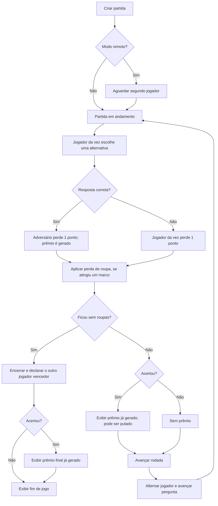

# Regras e funcionamento do jogo

> Documento de referência do comportamento **implementado** em 13/07/2026.
> Quando a interface sugere uma regra que o backend não garante, a diferença é
> indicada explicitamente.

## 1. Visão geral

O jogo é um quiz para exatamente dois jogadores. Ambos começam com 12 pontos e
quatro peças de roupa. Em cada rodada, o jogador da vez responde uma pergunta:

- se acertar, o adversário perde 1 ponto e quem respondeu recebe um prêmio;
- se errar, o próprio jogador da vez perde 1 ponto e não recebe prêmio;
- ao chegar às pontuações 9, 6, 3 e 0, o jogador punido perde uma peça;
- quem perder a quarta e última peça perde a partida;
- depois de uma resposta que não encerra o jogo, a vez passa ao outro jogador e
  a próxima pergunta da ordem sorteada é apresentada.

Apesar do nome `Score`, a pontuação funciona como **resistência restante**, não
como pontos acumulados: ela sempre começa em 12, só diminui e nunca aumenta.

## 2. Fluxo de uma partida

### 2.1 Sequência exata ao responder

O backend executa esta ordem:

1. Carrega a sessão.
2. No modo remoto, tenta validar se o `PlayerId` enviado é o jogador da vez.
3. Se a rodada já foi respondida, devolve o resultado persistido sem nova
   mutação.
4. Carrega a pergunta apontada por `CurrentQuestionIndex` e compara o índice
   recebido com `CorrectAnswerIndex`.
5. Escolhe o jogador punido: adversário no acerto, respondente no erro.
6. Reduz o `Score` do punido em 1, limitado ao mínimo de 0.
7. Verifica se a nova pontuação é um marco de perda de roupa.
8. Se não restar nenhuma peça, encerra a sessão e define o outro jogador como
   vencedor.
9. Se houve acerto, gera um prêmio mesmo quando a resposta acabou de encerrar a
   partida.
10. Persiste número da rodada, resultado pendente, progressão e estado da sessão.
11. Tenta registrar a resposta e o prêmio no histórico.
12. Devolve o resultado à interface e, na primeira aplicação, o transmite ao
    outro aparelho no modo
    remoto.

Responder **não** troca automaticamente a vez nem a pergunta. Isso acontece
somente na chamada separada de “avançar rodada”, depois da tela de resultado ou
prêmio.

## 3. Seleção das perguntas

### 3.1 Catálogo utilizado

As perguntas vêm do PostgreSQL. Apenas registros com `Active = true` entram no
catálogo disponível. Cada pergunta possui:

- ID numérico;
- enunciado;
- opções ordenadas por `OptionIndex`;
- exatamente uma opção marcada como correta;
- tema;
- nível;
- indicador de ativa/inativa.

O banco impede dois `OptionIndex` iguais na mesma pergunta, mas não garante que
exista uma quantidade mínima de opções nem exatamente uma opção correta. O
repositório usa `Single()` ao localizar a correta; dados com zero ou mais de uma
opção marcada como correta causam erro ao carregar a pergunta.

No primeiro startup com a tabela de perguntas vazia, o seeder cadastra 60
perguntas: 10 para cada um dos temas Harry Potter, Naruto, História do Brasil,
Geografia, Atualidades e Filmes da Disney. Todas as 60 têm nível 1.

O seeder é executado apenas quando a tabela inteira está vazia. Portanto,
alterações posteriores no arquivo de seed não atualizam automaticamente um banco
que já contém perguntas.

### 3.2 Sorteio da ordem

Ao criar ou reiniciar uma partida:

1. o repositório busca todas as perguntas ativas, inicialmente ordenadas por ID;
2. o serviço extrai apenas os IDs;
3. aplica um embaralhamento Fisher–Yates usando `Random.Shared`;
4. salva a lista completa em `QuestionOrder` na própria sessão;
5. começa no índice 0 dessa lista.

Consequências:

- cada partida/reinício recebe uma ordem independente;
- uma pergunta ativa no início aparece uma vez antes de qualquer repetição;
- as alternativas dentro da pergunta **não** são embaralhadas;
- tema, nível, placar, jogador e roupas não participam do sorteio;
- perguntas adicionadas depois de a partida começar não entram nela;
- ao chegar ao fim da lista, o índice usa módulo e volta ao começo, sem novo
  embaralhamento.

Seguindo o fluxo normal, uma partida termina entre 12 e 23 respostas. Como o
catálogo inicial tem 60 perguntas, ele não chega a repetir perguntas numa única
partida normal.

### 3.3 O que “nível” faz hoje

Hoje, `Level` é apenas metadado exibido na etiqueta da pergunta (`Nível 1`). Não
existe:

- progressão de dificuldade por rodada;
- seleção baseada na quantidade de roupas;
- adaptação ao desempenho de cada jogador;
- balanceamento de temas ou níveis;
- configuração de dificuldade antes da partida;
- pesos diferentes de sorteio.

Como todas as perguntas iniciais têm nível 1, o jogo atual não possui
nivelamento efetivo. Cadastrar perguntas com outros níveis faria o número
aparecer na tela, mas ainda assim elas seriam misturadas uniformemente com as
demais perguntas ativas.

### 3.4 Resposta correta e opções

Internamente, as alternativas são índices baseados em zero. A resposta é correta
somente quando `SelectedOptionIndex == CorrectAnswerIndex`. O estado da pergunta
enviado antes da resposta não contém o índice correto; após responder, o resultado
inclui esse índice para a interface mostrar a letra correta.

Não existe validação explícita de faixa. Um índice negativo ou maior que a
quantidade de opções simplesmente será tratado como resposta errada.

### 3.5 Pergunta desativada durante uma partida

A sessão guarda IDs, então a remoção ou desativação posterior de uma pergunta
não invalida toda a ordem. Se o ID atual não puder mais ser carregado, o serviço
busca a primeira pergunta ativa, em ordem de ID, cujo ID pertença à ordem original.

Esse fallback não avança nem corrige o índice salvo e não procura a “próxima”
posição do embaralhamento. Por isso, uma desativação no meio da partida pode
causar repetição ou quebrar a ordem sorteada. Se nenhuma pergunta original ainda
estiver ativa, a jogada falha com “Não há perguntas disponíveis para esta
partida”.

## 4. Prêmios

> A mecânica progressiva está implementada atrás da flag
> `Rewards:IntelligentSelectionEnabled`. Ela permanece `true` por padrão; o valor
> `false` existe somente para rollback explícito. A especificação completa está na
> [`proposta de nivelamento inteligente dos prêmios`](proposta-nivelamento-inteligente-de-premios.md).

### 4.1 Quando e para quem um prêmio é gerado

Um prêmio é gerado em todo acerto e nunca em um erro, inclusive quando o acerto
encerra a partida. O jogador que errou indiretamente — o adversário punido pelo
acerto — é o ator que oferece o prêmio; quem respondeu corretamente é o
recebedor. Esses papéis e a rodada ficam gravados junto do prêmio.

### 4.2 Modos de seleção

| Flag | Funcionamento |
|---|---|
| desligada, padrão atual de deploy | mantém o gerador legado: ação, local e duração são sorteados separadamente entre 360 combinações possíveis |
| ligada | seleciona uma unidade editorial completa entre 49 templates curados e versionados; partes de templates diferentes nunca são combinadas |

O modo inteligente elimina combinações incidentais como “mordida no nariz”. Cada
template informa texto, família de ação, local/contexto, nível, papéis, requisito
de roupa, tipo e valores de execução, peso, cooldown e estado ativo.

### 4.3 Nível de intensidade

O nível é recalculado depois da punição e eventual perda de roupa. Vale o maior
número de peças já perdidas por qualquer um dos jogadores:

| Maior quantidade perdida | Nível | Nome |
|---:|---:|---|
| 0 | 1 | Conexão |
| 1 | 2 | Aproximação |
| 2 | 3 | Tensão |
| 3 ou 4 | 4 | Intimidade |

Ao entrar em um novo estágio, o contador de prêmios daquele estágio volta a
zero. Nos dois primeiros prêmios, o nível atual e o anterior têm 50% de chance.
A partir do terceiro, a distribuição passa para 75% no nível atual e 25% no
anterior. No nível 1, sempre é escolhido o próprio nível.

### 4.4 Elegibilidade, variedade e fallback

Depois de escolher o nível-alvo, o seletor:

1. mantém somente templates ativos, destinados ao adversário como ator e ao
   vencedor da pergunta como recebedor;
2. verifica os requisitos contra as roupas do recebedor;
3. respeita o cooldown do template;
4. evita repetir a família do último prêmio quando existe alternativa;
5. reduz pela metade o peso de locais usados nos três últimos prêmios;
6. aumenta em 25% o peso de templates com valor de execução ainda não usado;
7. faz um sorteio ponderado e instancia o texto com os nomes dos jogadores.

Se o nível sorteado não tiver candidato, tenta o nível adjacente permitido. Se
ainda estiver vazio, relaxa apenas o cooldown e repete as tentativas. Requisitos
de roupa, papéis e curadoria nunca são relaxados. O histórico recente usado pelo
algoritmo mantém no máximo 12 prêmios.

### 4.5 Feito, pular e prêmio final

Para a regra do backend, “Feito” e “Pular” são equivalentes: ambos avançam a
rodada, e a escolha não é enviada nem registrada. Quando um acerto encerra a
partida, a interface abre o prêmio final já persistido antes de mostrar o
vencedor.

## 5. Pontuação e progressão das roupas

Cada jogador começa com 12 pontos e todas estas peças, perdidas obrigatoriamente
nesta ordem:

1. meias (`Socks`);
2. camiseta (`Shirt`);
3. calça (`Pants`);
4. peça íntima (`Underwear`).

| Pontuação após a punição | Evento | Peças restantes |
|---:|---|---:|
| 12 | estado inicial | 4 |
| 11 | perde apenas 1 ponto | 4 |
| 10 | perde apenas 1 ponto | 4 |
| 9 | perde as meias | 3 |
| 8 | perde apenas 1 ponto | 3 |
| 7 | perde apenas 1 ponto | 3 |
| 6 | perde a camiseta | 2 |
| 5 | perde apenas 1 ponto | 2 |
| 4 | perde apenas 1 ponto | 2 |
| 3 | perde a calça | 1 |
| 2 | perde apenas 1 ponto | 1 |
| 1 | perde apenas 1 ponto | 1 |
| 0 | perde a peça íntima e a partida termina | 0 |

Portanto, uma peça é perdida a cada três punições recebidas. São necessárias 12
punições sobre o mesmo jogador para retirar todas as peças. Acertos e erros não
têm pesos distintos: ambos retiram exatamente 1 ponto; muda apenas quem é punido.

A sessão também guarda `ClothingLostAtScores` com os marcos já processados. Essa
lista evita aplicar duas perdas no mesmo marco caso o estado seja reprocessado.
Ela é limpa no reinício.

As roupas não alteram a seleção das perguntas. Com a seleção inteligente de
prêmios ativa, porém, a perda de roupa eleva o nível de intensidade conforme a
tabela da seção 4 e também participa dos filtros de acessibilidade do recebedor.
Com a flag desligada, o gerador legado continua sem relação com as roupas.

## 6. Turnos, vitória e reinício

- O jogador de índice 0 sempre começa uma partida nova e um reinício.
- Após uma rodada não terminal, `CurrentPlayerIndex` alterna entre 0 e 1.
- A alternância ocorre mesmo que o jogador da vez tenha acertado; não existe
  turno extra por acerto.
- A pergunta também avança exatamente uma posição nesse momento.
- Quem perde a última peça é o perdedor; o vencedor é sempre o outro jogador.
- Ao terminar, o status vira `Finished`, são salvos `WinnerPlayerId` e
  `FinishedAt`, e não há avanço de turno/pergunta.

No reinício, os mesmos jogadores e, no modo remoto, o mesmo código de sala são
mantidos. Pontos, roupas, marcos de roupa, vencedor e data de término são
zerados; uma nova ordem de perguntas é sorteada. O jogador 0 volta a começar.

## 7. Modos local e remoto

| Aspecto | Local | Remoto |
|---|---|---|
| Aparelhos | Um aparelho compartilhado | Um aparelho por jogador |
| Criação | Já cria os dois jogadores e inicia | Cria só o jogador 1 e fica aguardando |
| Início | Imediato | Quando o segundo jogador entra |
| Identidade enviada | Nenhuma | `PlayerId` salvo no navegador |
| Sincronização | Estado React + API | API + eventos SignalR por `gameId` |
| Interação na UI | Sempre habilitada para a vez exibida | Só o aparelho do jogador da vez interage |

### 7.1 Sala remota

O código possui quatro caracteres e usa o alfabeto
`ABCDEFGHJKMNPQRSTUVWXYZ23456789`, sem 0/O e 1/I/L. Há 31 símbolos e 923.521
códigos possíveis. O serviço tenta até 50 combinações para obter um código ainda
não usado no banco. A unicidade inclui salas em espera, em andamento e já
encerradas; códigos de partidas finalizadas não são reutilizados. Na entrada, o
código é aparado e normalizado para maiúsculas, então letras minúsculas são
aceitas.

Ao entrar, um novo jogador ocupa o índice 1 e a partida passa de
`WaitingForOpponent` para `InProgress`. Se o navegador enviar um `PlayerId` que
já pertence à sala, a entrada é tratada como reentrada idempotente, inclusive se
a partida já estiver em andamento ou encerrada.

### 7.2 Retomada e tempo real

O navegador salva `gameId`, `playerId`, código e nome no `localStorage`. Depois de
um refresh, consulta novamente o estado persistido no backend. O backend também
persiste o número da rodada e o resultado pendente. Assim, a interface reconstrói
a tela de resultado ou prêmio sem permitir que a mesma pergunta seja processada
novamente. Se o resultado terminal tiver prêmio, ele também é retomado antes da
tela de vencedor.

SignalR apenas distribui notificações (`PlayerJoined`, `AnswerSubmitted`,
`RoundAdvanced` e `GameRestarted`). O PostgreSQL é a fonte durável do estado. Em
uma reconexão do hub, o cliente reentra no grupo e busca o estado atual pela API.

## 8. Estados da sessão

| Estado | Significado | Pergunta incluída em `GameState` |
|---|---|---|
| `WaitingForOpponent` | sala remota ainda com um jogador | não |
| `InProgress` | partida apta a receber respostas | sim |
| `Finished` | alguém perdeu a última peça | não |

Principais campos persistidos da sessão: modo, status, jogadores, jogador atual,
índice e ordem das perguntas, rodada, rodada respondida, resultado pendente,
progressão dos prêmios, versão de concorrência, código da sala, vencedor e datas.
Para cada jogador são persistidos nome, pontuação, quatro flags de roupa e os
marcos de roupa já aplicados.

Cada resposta e cada prêmio também são gravados em tabelas de histórico. O prêmio
inteligente registra template, versão do catálogo, intensidade, ator, recebedor,
rodada e execução, além do texto final. Esses logs são “melhor esforço”: qualquer
falha é registrada no log da aplicação, mas não desfaz nem bloqueia a jogada já
persistida. Não há transação única envolvendo estado, resposta e prêmio.

## 9. API do jogo

| Método e rota | Função |
|---|---|
| `POST /api/games` | cria partida local |
| `POST /api/games/remote` | cria sala remota |
| `POST /api/games/join` | entra ou reentra em sala remota |
| `GET /api/games/{gameId}` | obtém o estado atual |
| `GET /api/games/{gameId}/question` | obtém diretamente a pergunta apontada pela sessão |
| `POST /api/games/{gameId}/answer` | avalia e aplica uma resposta |
| `POST /api/games/{gameId}/next` | alterna jogador e pergunta |
| `POST /api/games/{gameId}/restart` | reinicia a sessão existente |

Os DTOs de pergunta não revelam a resposta correta antes da jogada. Já o
resultado da resposta contém a correção, o jogador punido, eventual roupa
perdida, eventual prêmio, o vencedor e um retrato completo do novo estado.

## 10. Garantias da interface versus garantias do backend

A interface conduz o fluxo esperado, mas algumas regras não são protegidas pela
API. Para usuários comuns isso tende a ficar invisível; para integrações e novos
clientes, são limitações relevantes.

### 10.1 Uma única resposta por rodada é garantida

`RoundNumber`, `AnsweredRoundNumber` e `PendingRoundResult` formam a chave de
idempotência da rodada. A primeira chamada a `/answer` aplica a punição, gera o
eventual prêmio, persiste o resultado e escreve o histórico. Repetições antes de
`/next` devolvem o mesmo resultado com `StateChanged = false`, sem nova mutação,
novo prêmio ou novo evento de histórico. `/next` rejeita o avanço enquanto a
rodada ainda não tiver sido respondida.

### 10.2 Identidade remota é opcional na validação

O backend rejeita uma ação remota quando recebe um `PlayerId` diferente do
jogador atual. Porém, se `PlayerId` for omitido, a validação retorna sem conferir
a identidade. IDs não têm autenticação ou assinatura. Assim, a restrição “só o
jogador da vez” é forte na interface oficial, mas contornável por chamadas diretas
à API.

### 10.3 Autorização remota ainda tem proteções incompletas

- `/next` pode ser chamado sem `PlayerId`, inclusive no modo remoto;
- `/restart` não valida jogador, modo nem status;
- o reinício exige dois jogadores, mas não uma credencial de quem solicitou;
- chamadas simultâneas usam a versão persistida da sessão e uma gravação obsoleta
  é rejeitada por concorrência otimista, em vez de sobrescrever silenciosamente.

### 10.4 Validações de entrada são mínimas

Não há validação explícita de índice da alternativa, tamanho dos nomes ou formato
do GUID além da desserialização padrão. Nomes em branco recebem valores padrão,
mas nomes maiores que o limite do banco podem resultar em erro de persistência.

### 10.5 Fim de jogo e prêmio final

Um acerto terminal gera, persiste e apresenta o prêmio antes da tela de vencedor.
Concluir ou pular esse prêmio apenas encerra o fluxo visual; não há chamada a
`/next` em uma partida já finalizada.

## 11. Pontos de extensão recomendados

Para evoluir as regras sem ambiguidades, os pontos naturais são:

- **nivelamento das perguntas:** substituir o embaralhamento plano por uma
  estratégia que filtre ou dê peso a `Level`, rodada ou desempenho;
- **balanceamento de temas:** criar filas por tema ou impedir sequências longas
  do mesmo assunto;
- **autorização remota:** exigir uma credencial não opcional por jogador em todas
  as mutações;
- **curadoria de conteúdo:** versionar perguntas e revisar periodicamente questões
  de Atualidades, que podem ficar desatualizadas.

## 12. Mapa do código-fonte

| Responsabilidade | Fonte principal |
|---|---|
| Regra de ponto, roupa e vitória | [`GameRules.cs`](../Backend/src/Game.Domain/Rules/GameRules.cs) |
| Estado da sessão e jogadores | [`GameSession.cs`](../Backend/src/Game.Domain/Entities/GameSession.cs), [`Player.cs`](../Backend/src/Game.Domain/Entities/Player.cs) |
| Orquestração de perguntas, respostas, turno e reinício | [`GameService.cs`](../Backend/src/Game.Application/Services/GameService.cs) |
| Catálogo inicial de perguntas | [`QuestionSeedData.cs`](../Backend/src/Game.Infrastructure/Data/QuestionSeedData.cs) |
| Leitura de perguntas ativas | [`PostgresQuestionRepository.cs`](../Backend/src/Game.Infrastructure/Repositories/PostgresQuestionRepository.cs) |
| Catálogo inteligente de prêmios | [`reward-templates.v1.json`](../Backend/src/Game.Infrastructure/Data/Rewards/reward-templates.v1.json), [`JsonRewardCatalog.cs`](../Backend/src/Game.Infrastructure/Rewards/JsonRewardCatalog.cs) |
| Seleção, níveis e fallback | [`RewardSelector.cs`](../Backend/src/Game.Application/Rewards/RewardSelector.cs), [`RewardRules.cs`](../Backend/src/Game.Domain/Rules/RewardRules.cs) |
| Gerador legado para rollback | [`PrizeSeedData.cs`](../Backend/src/Game.Infrastructure/Data/PrizeSeedData.cs), [`RandomRewardProvider.cs`](../Backend/src/Game.Infrastructure/Repositories/RandomRewardProvider.cs) |
| Persistência da sessão | [`PostgresGameSessionRepository.cs`](../Backend/src/Game.Infrastructure/Repositories/PostgresGameSessionRepository.cs) |
| Histórico de respostas e prêmios | [`PostgresGameActivityLog.cs`](../Backend/src/Game.Infrastructure/Repositories/PostgresGameActivityLog.cs) |
| Endpoints e eventos remotos | [`GamesController.cs`](../Backend/src/Game.Api/Controllers/GamesController.cs), [`GameHub.cs`](../Backend/src/Game.Api/Hubs/GameHub.cs) |
| Fluxo de telas do cliente | [`App.tsx`](../Frontend/src/App.tsx) |
| Contrato consumido pelo frontend | [`game.ts`](../Frontend/src/types/game.ts) |
